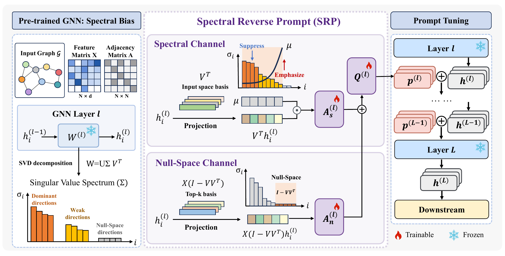

# Spectral Reversal (SRP)

**Paper:** *Spectral Reversal: Counteracting Singular Value Bias for Graph Prompting*<br>
**Venue:** NeurIPS 2026  **Spotlight**<br>
**Links:** [arXiv:2609.32143](http://arxiv.org/abs/2609.32143)

This repository contains the research implementation of **Spectral Reverse Prompt (SRP)** for parameter-efficient adaptation of pretrained graph neural networks.

Self-supervised pre-training can bias GNN representations toward directions associated with large singular values, leaving low-energy components under-explored. Spectral Reverse Prompt (SRP) addresses this spectral bias with a learnable soft-thresholding mask that down-weights dominant directions and amplifies weaker ones, together with a null-space augmentation module that captures complementary variation minimally expressed by the frozen encoder. By rebalancing these spectral contributions, SRP enables parameter-efficient graph adaptation with minimal additional parameters.




## Repository layout

```text
node/       Node classification experiments (GCN)
graph/      Graph classification experiments (GIN)
images/     Method figures
```

## Installation

The experiments reported in the paper used Ubuntu 22.04, Python 3.10.19, CUDA 12.1, PyTorch 2.5.1, PyTorch Geometric 2.7.0, and an NVIDIA RTX 3090 (24 GB). The commands below install these software versions.

```bash
python -m venv .venv
source .venv/bin/activate
python -m pip install --upgrade pip
pip install torch==2.5.1
pip install -r requirements.txt
```

For CUDA installations, install the PyTorch wheel matching your driver first. The following is the CUDA 12.1 setup used in the paper:

```bash
pip install torch==2.5.1 --index-url https://download.pytorch.org/whl/cu121
pip install -r requirements.txt
```

The PyG extension wheels must match the installed PyTorch/CUDA combination. For the tested environment:

```bash
pip install --find-links https://data.pyg.org/whl/torch-2.5.1+cu121.html \
  torch-scatter==2.1.2+pt25cu121 \
  torch-sparse==0.6.18+pt25cu121 \
  torch-cluster==1.6.3+pt25cu121 \
  torch-spline-conv==1.2.2+pt25cu121
```

## Data and pretrained checkpoints

The PyG datasets are downloaded automatically into `node/data/` and `graph/data/` on first use. The GraphCL and SimGRACE pretrained GNN checkpoints required for the paper's main results are included in `node/pretrained_gnns/` and `graph/pretrained_gnns/`, so no separate checkpoint download is required.

## Node classification: Cora example

Run five seeds sequentially and save per-seed logs plus a JSON/CSV summary:

```bash
cd node
python downstream_task.py \
  --dataset_name Cora \
  --pretrain_task GraphCL \
  --prompt_type SRP \
  --shots 5 \
  --adapter_dim 32 \
  --pca_dim 16 \
  --seeds 0 1 2 3 4
```

To run one seed, which is convenient for parallel jobs:

```bash
python downstream_task.py --dataset_name Cora --prompt_type SRP \
  --pretrain_task GraphCL --shots 5 --seed 0
```

The default SRP settings are `r_s = 32` (`--adapter_dim 32`) and `m = 16` (`--pca_dim 16`).

## Graph classification: NCI1 example

```bash
cd graph
python downstream_task.py \
  --dataset_name NCI1 \
  --pretrain_task GraphCL \
  --prompt_type SRP \
  --shots 50 \
  --adapter_dim 32 \
  --pca_dim 16 \
  --seeds 0 1 2 3 4
```

Supported node datasets are Cora, CiteSeer, PubMed, ogbn-arxiv, and Flickr. Supported graph datasets are ENZYMES, DD, NCI1, NCI109, and Mutagenicity.
